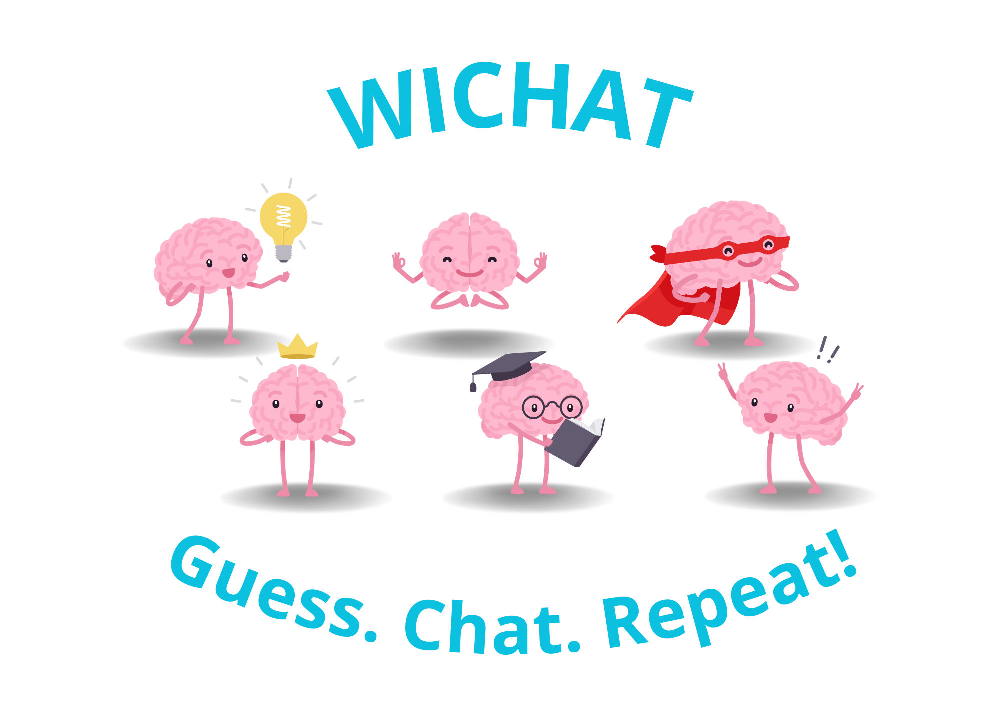

[](https://github.com/arquisoft/wichat_en3b/actions)
[](https://sonarcloud.io/summary/new_code?id=Arquisoft_wichat_en3b)
[](https://sonarcloud.io/summary/new_code?id=Arquisoft_wichat_en3b)



# Meet our team 👥
| Name                     | Email                        |
|--------------------------|------------------------------|
| Víctor Llana Pérez       | uo294629@uniovi.es           |
| Lara Haya Santiago       | uo289684@uniovi.es           |
| Alba González Arango     | uo289041@uniovi.es           |
| Marco Lorenzo Martínez   | uo294324@uniovi.es           |
| Javier Menéndez Osendi   | uo294866@uniovi.es           |
| Daniel Rodríguez Fernández| uo293655@uniovi.es          |

[Link to our game 👾](http://158.179.209.153:3000)

[Read the Documentation 📖](https://arquisoft.github.io/wichat_en3b/)

# About WICHAT 💡
Wichat_en3b is a fun and interactive web-based quiz game we created for the Software Architecture course (2024/2025). It’s more than just your average chat app — we’ve packed it with several cool features that make it stand out. At its core, Wichat is built using React for the frontend and Node.js (Express) for the backend, while MongoDB handles the database. But what truly makes it special is the integration with an AI-powered LLM from Empathy, which brings smart assistance to your game experience.

In Wichat Quiz, you can test your knowledge in a variety of engaging and dynamic ways. The game offers multiple quiz modes, so you can choose from categories like Singers 🎤, Flags 🌍, Cities 🏙️, or mix and match two categories for an added challenge. If you can’t pick just one, don’t worry — you can activate Wild Mode 🔥 to throw in all categories for a crazy, unpredictable experience!

There are two exciting ways to play: Round Mode 🏁 or Against the Clock ⏳. In Round Mode, you’ll face a set number of questions, while in Against the Clock, the pressure’s on to answer as many questions as you can before the time runs out. The game keeps things fresh and challenging, with a wide range of questions drawn from Wikidata 🌐, ensuring you always have new content to tackle.

Need some help? No problem! Our Hint System 💡 has got you covered:
- 50/50: We’ll eliminate two incorrect answers to make it easier.
- Ask the Audience: Get the crowd’s opinion on the right answer.
- LLM Chat: Feeling stuck? Chat with our AI assistant for a bit of guidance!

But that’s not all. The game rewards you for quick answers, so the faster you go, the higher your score! Keep answering correctly, collect rewards, and see how high you can climb.

Create an account or log in to challenge your friends and see who’s the ultimate trivia champion. Whether you're here to test your own knowledge or compete with others, Wichat Quiz is the perfect way to have fun and learn something new along the way!


# Technologies

<p float="left">


</p>

This is a base project for the Software Architecture course in 2024/2025. It is a basic application composed of several components.

- **User service**. This is an Express-based service responsible for managing user data. It handles the insertion of new users into the system, ensuring proper registration and initial setup. The user service communicates with a MongoDB database to store user information, and it integrates with other services to facilitate user management within the app. It also handles tasks like updating user profiles and validating user information.
- **Auth service**. Express service that handles the authentication of users.
- **LLM service**. The LLM (Large Language Model) service is another key piece of the project. This Express-based service is responsible for communicating with the integrated LLM (powered by Empathy) to provide AI-driven responses and assistance to users. The LLM service processes requests from the web application, querying the language model to generate responses based on user input. This service also manages the interaction with the model's API, ensuring smooth communication between the app and the AI.
- **Gateway service**. The gateway service acts as a reverse proxy and a centralized point for routing requests from the public (users). Built with Express, it exposes the public-facing endpoints and directs incoming requests to the appropriate backend services (user, auth, and LLM services). It plays a crucial role in managing traffic and ensuring that requests are securely routed to the right components. By acting as an intermediary, it decouples the front-end from the backend services, providing a more secure and flexible architecture.Express service that is exposed to the public and serves as a proxy to the two previous ones.
- **Webapp**. The web application is the front-end component of the system, built with React. It provides the user interface, allowing users to interact with the system. Through the webapp, users can log in, register as new users, and engage with the AI-powered quiz game. The web application communicates with the backend services via the gateway service, utilizing the exposed endpoints to handle user authentication, registration, and interactions with the LLM. The webapp also provides an interactive, dynamic interface for playing the quiz game, switching between categories, and displaying results.

All of these services are integrated with a shared MongoDB database, where the user and authentication services store and retrieve user-related data. The database is accessed using Mongoose, a powerful ODM (Object-Document Mapper) for MongoDB, which simplifies data operations and ensures the seamless flow of information between services.

## Quick start guide

First, clone the project:

```git clone git@github.com:arquisoft/wichat_en3b.git```

### LLM API key configuration

In order to communicate with the LLM integrated in this project, we need to setup an API key. Two integrations are available in this propotipe: gemini and empaphy. The API key provided must match the LLM provider used.

We need to create two .env files. 
- The first one in the llmservice directory (for executing the llmservice using ```npm start```). The content of this .env file should be as follows:
```
LLM_API_KEY="YOUR-API-KEY"
```
- The second one located in the root of the project (along the docker-compose.yml). This .env file is used for the docker-compose when launching the app with docker. The content of this .env file should be as follows:
```
LLM_API_KEY="YOUR-API-KEY"
```

Note that these files must NOT be uploaded to the github repository (they are excluded in the .gitignore).

An extra configuration for the LLM to work in the deployed version of the app is to create the same .env file (with the LLM_API_KEY variable) in the virtual machine (in the home of the azureuser directory).

### Launching Using docker
For launching the propotipe using docker compose, just type:
```docker compose --profile dev up --build```

### Component by component start
First, start the database. Either install and run Mongo or run it using docker:

```docker run -d -p 27017:27017 --name=my-mongo mongo:latest```

You can use also services like Mongo Altas for running a Mongo database in the cloud.

Now launch the auth, user and gateway services. Just go to each directory and run `npm install` followed by `npm start`.

Lastly, go to the webapp directory and launch this component with `npm install` followed by `npm start`.

After all the components are launched, the app should be available in localhost in port 3000.

## Deployment
For the deployment, we have several options. The first and more flexible is to deploy to a virtual machine using SSH. This will work with any cloud service (or with our own server). Other options include using the container services that all the cloud services provide. This means, deploying our Docker containers directly. Here I am going to use the first approach. I am going to create a virtual machine in a cloud service and after installing docker and docker-compose, deploy our containers there using GitHub Actions and SSH.

### Machine requirements for deployment
The machine for deployment can be created in services like Microsoft Azure or Amazon AWS. These are in general the settings that it must have:

- Linux machine with Ubuntu > 20.04 (the recommended is 24.04).
- Docker installed.
- Open ports for the applications installed (in this case, ports 3000 for the webapp and 8000 for the gateway service).

Once you have the virtual machine created, you can install **docker** using the following instructions:

```ssh
sudo apt update
sudo apt install apt-transport-https ca-certificates curl software-properties-common
curl -fsSL https://download.docker.com/linux/ubuntu/gpg | sudo apt-key add -
sudo add-apt-repository "deb [arch=amd64] https://download.docker.com/linux/ubuntu focal stable"
sudo apt update
sudo apt install docker-ce
sudo usermod -aG docker ${USER}
```

### Continuous delivery (GitHub Actions)
Once we have our machine ready, we could deploy by hand the application, taking our docker-compose file and executing it in the remote machine. In this repository, this process is done automatically using **GitHub Actions**. The idea is to trigger a series of actions when some condition is met in the repository. The precondition to trigger a deployment is going to be: "create a new release". The actions to execute are the following:


As you can see, unitary tests of each module and e2e tests are executed before pushing the docker images and deploying them. Using this approach we avoid deploying versions that do not pass the tests.

The deploy action is the following:

```yml
deploy:
    name: Deploy over SSH
    runs-on: ubuntu-latest
    needs: [docker-push-userservice,docker-push-authservice,docker-push-llmservice,docker-push-gatewayservice,docker-push-webapp]
    steps:
    - name: Deploy over SSH
      uses: fifsky/ssh-action@master
      with:
        host: ${{ secrets.DEPLOY_HOST }}
        user: ${{ secrets.DEPLOY_USER }}
        key: ${{ secrets.DEPLOY_KEY }}
        command: |
          wget https://raw.githubusercontent.com/arquisoft/wichat_en3b/master/docker-compose.yml -O docker-compose.yml
          docker compose --profile prod down
          docker compose --profile prod up -d --pull always
```

This action uses three secrets that must be configured in the repository:
- DEPLOY_HOST: IP of the remote machine.
- DEPLOY_USER: user with permission to execute the commands in the remote machine.
- DEPLOY_KEY: key to authenticate the user in the remote machine.

Note that this action logs in the remote machine and downloads the docker-compose file from the repository and launches it. Obviously, previous actions have been executed which have uploaded the docker images to the GitHub Packages repository.
