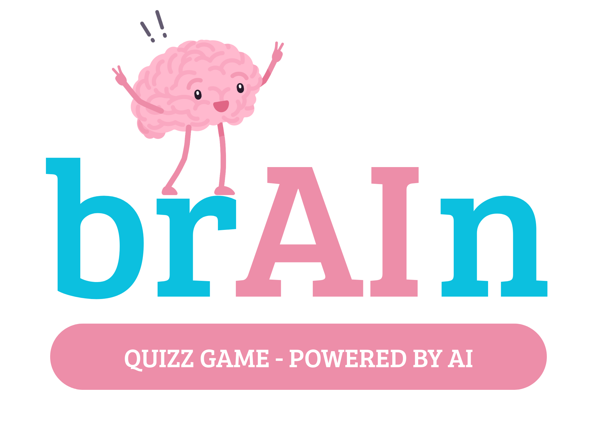

[](https://github.com/arquisoft/wichat_en3b/actions)
[](https://sonarcloud.io/summary/new_code?id=Arquisoft_wichat_en3b)
[](https://sonarcloud.io/summary/new_code?id=Arquisoft_wichat_en3b)


👾 **[Play the Game](http://158.179.209.153:3000)** | 📖 **[Read the Documentation](https://arquisoft.github.io/wichat_en3b/)**



# Meet our team 👥
| Name                     | Email                        |
|--------------------------|------------------------------|
| Víctor Llana Pérez       | uo294629@uniovi.es           |
| Lara Haya Santiago       | uo289684@uniovi.es           |
| Alba González Arango     | uo289041@uniovi.es           |
| Marco Lorenzo Martínez   | uo294324@uniovi.es           |
| Javier Menéndez Osendi   | uo294866@uniovi.es           |
| Daniel Rodríguez Fernández| uo293655@uniovi.es          |

# brAIn: Your Brain’s New Best Friend

# 💡About brAIn 
brAIn is a fun and interactive web-based quiz game we created for the Software Architecture course (2024/2025). It’s way more than just your average quiz — we’ve packed it with quirky characters, smart hints, and AI magic to keep you hooked!
At its core, brAIn is built using React for the frontend and Node.js (Express) for the backend, with MongoDB taking care of the database. But what truly makes it shine is the integration of an AI-powered LLM from Empathy — bringing real smart assistance into your game experience. 🧠✨

In brAIn Quiz, you’ll put your knowledge to the test across a variety of lively and dynamic modes. Choose from categories like Singers 🎤, Flags 🌍, Cities 🏙️, and many more!
Can’t decide? Mix two categories for a double challenge, or go totally wild with Wild Mode 🔥 — where anything (and everything) can happen!

There are three exciting ways to play:

- Round Mode 🏁: Face a set number of questions and see how many you can get right!
- Against the Clock ⏳: Beat the clock by answering as many questions as you can before time runs out!
- Hidden Image Mode 🕵️‍♂️: The image starts hidden and is gradually revealed — the faster you guess, the more points you earn!

The game keeps things fresh and challenging, with a wide range of questions drawn from Wikidata 🌐, ensuring you always have new content to tackle.

Need some help? No problem! Our Hint System 💡 has got you covered:
- 50/50: We’ll eliminate two incorrect answers to make it easier.
- Ask the Audience: Get the crowd’s opinion on the right answer.
- Call a Friend: Ring up one of our quirky "friends" — some are brainiacs, some... not so much. Choose wisely! 📞
- LLM Chat: Feeling stuck? Chat casually with famous personalities powered by AI! They'll drop tiny hints to guide you — but never reveal the answer directly.

# 🚀 More Than Just Trivia

brAIn isn’t just about getting answers right — it’s about how you get them right!
The faster you guess, the bigger your rewards. Collect coins, unlock achievements, and climb the leaderboard to prove you're the ultimate BrainBuddy! 🏆
 

Create an account or log in to challenge your friends and see who’s the ultimate trivia champion. Whether you're here to test your own knowledge or compete with others, brAIn Quiz is the perfect way to have fun and learn something new along the way! 🧠💥

# Technologies

<p float="left">


</p>

This is a base project for the Software Architecture course in 2024/2025. It is a basic application composed of several components.

- **User service**. This is an Express-based service responsible for managing user data. It handles the insertion of new users into the system, ensuring proper registration and initial setup. The user service communicates with a MongoDB database to store user information, and it integrates with other services to facilitate user management within the app. It also handles tasks like updating user profiles and validating user information.
- **Auth service**. Express service that handles the authentication of users.
- **LLM service**. The LLM (Large Language Model) service is another key piece of the project. This Express-based service is responsible for communicating with the integrated LLM (powered by Empathy) to provide AI-driven responses and assistance to users. The LLM service processes requests from the web application, querying the language model to generate responses based on user input. This service also manages the interaction with the model's API, ensuring smooth communication between the app and the AI.
- **Gateway service**. The gateway service acts as a reverse proxy and a centralized point for routing requests from the public (users). Built with Express, it exposes the public-facing endpoints and directs incoming requests to the appropriate backend services (user, auth, and LLM services). It plays a crucial role in managing traffic and ensuring that requests are securely routed to the right components. By acting as an intermediary, it decouples the front-end from the backend services, providing a more secure and flexible architecture.Express service that is exposed to the public and serves as a proxy to the two previous ones.
- **Webapp**. The web application is the front-end component of the system, built with React. It provides the user interface, allowing users to interact with the system. Through the webapp, users can log in, register as new users, and engage with the AI-powered quiz game. The web application communicates with the backend services via the gateway service, utilizing the exposed endpoints to handle user authentication, registration, and interactions with the LLM. The webapp also provides an interactive, dynamic interface for playing the quiz game, switching between categories, and displaying results.
- **Question Service**. This Express-based service is responsible for generating quiz questions by retrieving data from Wikidata using SPARQL queries. It connects to a MongoDB database to store and manage quiz-related data, such as cities, flags, athletes, and singers. The service periodically fetches and updates data, ensuring an up-to-date and diverse set of questions. It provides endpoints for loading quiz data and generating game rounds with random questions, selecting items dynamically based on available categories.

All of these services interact with a shared MongoDB database, where user-related data is managed by the user and authentication services. Mongoose, a robust Object-Document Mapper (ODM), simplifies database interactions, enabling efficient data storage, retrieval, and validation. This shared database ensures smooth communication between services, maintaining consistency and synchronization across the system.  


## Quick start guide

First, clone the project:

```git clone git@github.com:arquisoft/wichat_en3b.git```

### LLM API key configuration

In order to communicate with the LLM integrated in this project, we need to setup an API key. Two integrations are available in this propotipe: gemini and empaphy. The API key provided must match the LLM provider used.

We need to create two .env files. 
- The first one in the llmservice directory (for executing the llmservice using ```npm start```). The content of this .env file should be as follows:
```
LLM_API_KEY="YOUR-API-KEY"
```
- The second one located in the root of the project (along the docker-compose.yml). This .env file is used for the docker-compose when launching the app with docker. The content of this .env file should be as follows:
```
LLM_API_KEY="YOUR-API-KEY"
```

Note that these files must NOT be uploaded to the github repository (they are excluded in the .gitignore).

An extra configuration for the LLM to work in the deployed version of the app is to create the same .env file (with the LLM_API_KEY variable) in the virtual machine (in the home of the azureuser directory).

### Launching Using docker
For launching the propotipe using docker compose, just type:
```docker compose --profile dev up --build```

### Component by component start
First, start the database. Either install and run Mongo or run it using docker:

```docker run -d -p 27017:27017 --name=my-mongo mongo:latest```

You can use also services like Mongo Altas for running a Mongo database in the cloud.

Now launch the auth, user and gateway services. Just go to each directory and run `npm install` followed by `npm start`.

Lastly, go to the webapp directory and launch this component with `npm install` followed by `npm start`.

After all the components are launched, the app should be available in localhost in port 3000.

## Deployment
For the deployment of our project, we have chosen to use Oracle Cloud. The main approach is to deploy to a virtual machine using SSH. This gives us full flexibility and control over the environment.
We have a virtual machine instance on Oracle. We installed Docker and Docker Compose on the server, and we deploy our containers directly from GitHub using GitHub Actions and SSH.
This approach gives us full flexibility and control over the environment, ensuring an automated, consistent, and easily maintainable deployment process tailored specifically for our application's needs.

### Machine requirements for deployment
The machine for deployment can be created in services like Microsoft Azure or Amazon AWS. These are in general the settings that it must have:

- Linux machine with Ubuntu > 20.04 (the recommended is 24.04).
- Docker installed.
- Open ports for the applications installed (in this case, ports 3000 for the webapp and 8000 for the gateway service).

Once you have the virtual machine created, you can install **docker** using the following instructions:

```ssh
sudo apt update
sudo apt install apt-transport-https ca-certificates curl software-properties-common
curl -fsSL https://download.docker.com/linux/ubuntu/gpg | sudo apt-key add -
sudo add-apt-repository "deb [arch=amd64] https://download.docker.com/linux/ubuntu focal stable"
sudo apt update
sudo apt install docker-ce
sudo usermod -aG docker ${USER}
```

### Continuous delivery (GitHub Actions)
Once we have our Oracle Cloud machine ready, we could technically deploy the application manually by copying our docker-compose.yml file and executing it directly on the remote server.
However, in this project, the deployment process is fully automated using GitHub Actions.
The idea is simple: whenever a new release is created in the repository, a set of automated steps is triggered.
The deployment flow is as follows:


As you can see, unitary tests of each module and e2e tests are executed before pushing the docker images and deploying them. Using this approach we avoid deploying versions that do not pass the tests.

The deploy action is the following:

```yml
deploy:
    name: Deploy over SSH
    runs-on: ubuntu-latest
    needs: [docker-push-userservice,docker-push-authservice,docker-push-llmservice,docker-push-gatewayservice,docker-push-webapp]
    steps:
    - name: Deploy over SSH
      uses: fifsky/ssh-action@master
      with:
        host: ${{ secrets.DEPLOY_HOST }}
        user: ${{ secrets.DEPLOY_USER }}
        key: ${{ secrets.DEPLOY_KEY }}
        command: |
          wget https://raw.githubusercontent.com/arquisoft/wichat_en3b/master/docker-compose.yml -O docker-compose.yml
          docker compose --profile prod down
          docker compose --profile prod up -d --pull always
```

This action uses three secrets that must be configured in the repository:
- DEPLOY_HOST: IP of the remote machine.
- DEPLOY_USER: user with permission to execute the commands in the remote machine.
- DEPLOY_KEY: key to authenticate the user in the remote machine.

Note that this action logs in the remote machine and downloads the docker-compose file from the repository and launches it. Obviously, previous actions have been executed which have uploaded the docker images to the GitHub Packages repository.
